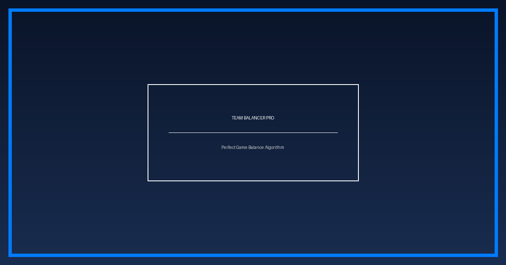

# 🎮 팀 밸런서 프로 (Team Balancer Pro)
> **데이터 기반 알고리즘으로 설계하는 완벽한 5:5 매치메이킹 도구**

---

### 🚀 [팀 밸런서 프로 바로가기 (Click)](https://autoteambalancer.pages.dev/)

리그 오브 레전드(LoL), 발로란트 등 내전(Civil War)이나 팀 게임 모임에서 **가장 공정한 팀 나누기**를 도와주는 웹 서비스입니다. 

---

## ✨ 주요 특징 (Key Features)

- **⚖️ 정밀한 밸런싱 알고리즘**: 플레이어의 티어(아이언~챌린저)와 세부 단계(1~4)를 점수화하여 팀 간의 실력 차이를 최소화하는 최적의 조합을 찾아냅니다.
- **🛡️ 포지션(라인) 정보 제공**: 단순한 실력 배분을 넘어, 주 포지션 정보를 함께 표시하여 전략적인 팀 조정을 돕습니다.
- **📱 완벽한 반응형 디자인**: PC는 물론 모바일 브라우저에서도 최적화된 화면으로 편리하게 이용할 수 있습니다.
- **📋 간편한 결과 공유**: 클릭 한 번으로 팀 나누기 결과를 복사하여 카카오톡이나 디스코드에 바로 붙여넣을 수 있습니다.

## 🛠️ 사용 방법 (How to Use)

1. **플레이어 정보 입력**: 10명의 플레이어 이름, 주 포지션, 현재 티어를 입력합니다. (정확한 정보를 모를 경우 예상 티어를 선택하세요.)
2. **랜덤 샘플 활용**: 테스트나 빠른 사용을 위해 '랜덤 샘플 채우기' 버튼을 활용할 수 있습니다.
3. **팀 나누기 실행**: '팀 나누기' 버튼을 클릭하면 알고리즘이 모든 조합을 계산하여 가장 균형 잡힌 블루/레드 팀을 보여줍니다.
4. **결과 복사**: 생성된 결과를 복사하여 팀원들과 공유하세요!

## 💻 기술 스택 (Tech Stack)

- **Frontend**: HTML5, Vanilla CSS, Modern JavaScript
- **Deployment**: GitHub Pages
- **Optimization**: SEO Meta Tags, JSON-LD Structured Data, Open Graph

---

## 🤝 제휴 및 문의 (Contact)

본 서비스는 무료로 제공되며, 기능 제안이나 제휴 문의는 사이트 하단의 문의 양식을 통해 남겨주세요.

---

### 🌍 관련 검색어
#팀짜기 #롤내전 #게임내전 #롤팀 #게임팀 #팀밸런서 #팀나누기 #발로란트내전 #팀밸런스사이트 #게임팀구성 #MMR계산기 #5대5팀나누기 #게임모임도구
